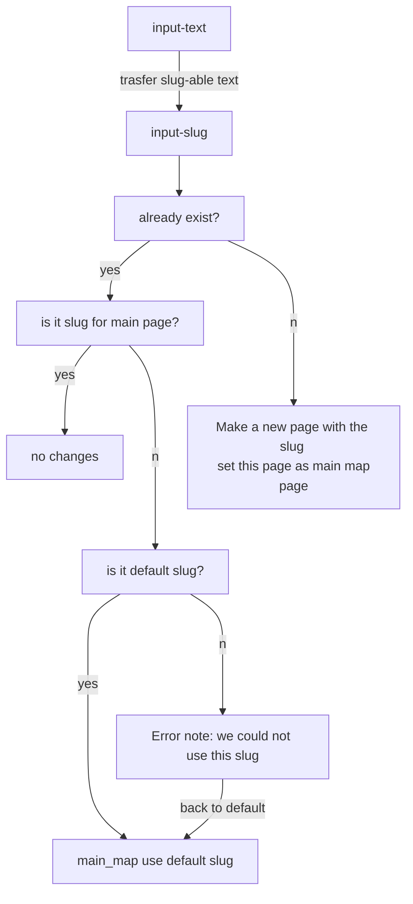

## Custom Template

    For map page and Post page, with target slug

- [x] Add admin menu 
  
  - [x] Admin menu 
    
    ```
        //////------------add Admin Menu----------------//
        add_action('admin_menu', array($this, 'adminPage'));
        add_action('admin_init', array($this, 'settings'));
    
          function adminPage() {
        add_options_page('Sinngrund Datenbank Setting', 'Sinngrund Ailianz', 'manage_options', 'sinngrund-datenbank-setting-page', array($this, 'ourHTML'));
      }
    
          //sad Sinngrund Allianz Datenbank
      function settings() {
        add_settings_section('sad_first_section', null, null, 'sinngrund-datenbank-setting-page');
    
        add_settings_field('sad_mainpage_slug', 'Page Slug', array($this, 'slug_inputHTML'), 'sinngrund-datenbank-setting-page', 'sad_first_section');
        register_setting('singrundallianzplugin', 'sad_mainpage_slug', array('sanitize_callback' => array($this, 'sanitizeLocation'), 'default' => 'map_page'));
    
        add_settings_field('wcp_headline', 'Headline Text', array($this, 'headlineHTML'), 'sinngrund-datenbank-setting-page', 'sad_first_section');
        register_setting('singrundallianzplugin', 'wcp_headline', array('sanitize_callback' => 'sanitize_text_field', 'default' => 'Post Statistics'));
      }
    
      function ourHTML() { ?>
        <div class="wrap">
          <h1>Sinngrund Allianz Datenbank Setting</h1>
          <form action="options.php" method="POST">
          <?php
            settings_fields('singrundallianzplugin');
            do_settings_sections('sinngrund-datenbank-setting-page');
            echo "check";
            echo $this->the_slug_exists(get_option('sad_mainpage_slug'));
            if($this->the_slug_exists(get_option('sad_mainpage_slug'))) { echo 'exists'; } else {echo 'set this slug';}
            submit_button();
          ?>
          </form>
        </div>
      <?php }
    ```

- [x] Input text box for slug 
  
  ```php
  function slug_inputHTML() { ?>
      <p>Current main Page : <?php echo esc_attr(get_option('sad_mainpage_slug')) ?> </p>
      new page slug
      <input type="text" name="sad_mainpage_slug" value="<?php echo esc_attr(get_option('sad_mainpage_slug')) ?>">
  <?php }
  ```

- [x] check if the slug exist if not make a page 
  
  ```
  function the_slug_exists($post_name) {
    global $wpdb;
    if($wpdb->get_row("SELECT post_name FROM wp_posts WHERE post_name = '" . $post_name . "'", 'ARRAY_A')) {
        return true;
    } else {
        return false;
    }
  }
  ```

- [x] and make the page as a map(main) page 
  
  main_map_slug setting with input  



```
  function sanitize_slug($input) {

    $default_slug = 'sinngrund-kulturedatenbank-diane';

    $input = sanitize_title($input);

    if ($input == esc_attr(get_option('sad_mainpage_slug'))){
      return $input;
    }
    else if ($this->the_slug_exists($input) && ($input != $default_slug)) {
      $message = $input . ': this is already exsited as slug. Map page is now setted with default slug:'. $default_slug;
      add_settings_error('sad_mainpage_slug', 'sad_mainpage_slug_error', $message);
      return $default_slug;
    }

    else if ($input != $default_slug) {
           // Create post object
        $my_post = array(
          'post_title'    => $input,
          'post_name'     => sanitize_title($input),
          'post_status'   => 'publish',
          'post_author'   => 1,
          'post_type'     => 'page',
        );

        // Insert the post into the database
        wp_insert_post( $my_post );
    }
    return $input;
  }
```

## Main Page and Post Template

- main Page template
  
  - [x] Static html, category, map, search box, sort option box

- post Page template
  
  - [x] Static html, map, post content

 


## To-do (start from 15.Aug)

## Github repository setting for Sinngrund

- @ github
  
  - account
  
  - repository url: https://github.com/Dinae-Kang/Sinngrund-Kulturdatenbank-plugin
  
  - repository name: Sinngrund-Kulturdatenbank-plugin

- @ Local computer
  
  - wpLocal - make a local website under plugin directory
    
    `git clone https://github.com/Dinae-Kang/Sinngrund-Kulturdatenbank-plugin.git`
  
  - ```
    git config --global user.name "diane-at-Okto"
    git config --global user.email "diane.kang@page-effect.com"
    ```
  
  - To check user name
    
    `git config --list`
  
  - `~/.../Sinngrund-Kulturdatenbank-plugin$ git init`

## Register Custom  Block/ datenbankblock

- Git commit 
  
  "Register kulturedatenbank Block", 2022-08-05)

## ~~Modity Custom Block, define block template~~

- Set default block(let my custom block show up always first)

- ~~Modify the Custom Block with InnerBlock~~~ <mark>Error appears</mark>
  
  Need to check, If i am dealing with JSX oder JS 
  
  What happend her: Using JS code -> Expected to work under JSX enviroment
  
  ```javascript
       return el( InnerBlocks, {
         template: BLOCKS_TEMPLATE,
         templateLock: false,
     } );
  ```

## JSX for my custom Plugin

- npm init -y 
  
  generate file package.json : For tracking the changes of node module

- Install WP script 
  
  ``$ npm install @wordpress/scripts --save-dev``

- Prepare for JSX
  
  make a directory named : **src**
  
  under src directory make a file named: **index.js**
  
  copy all contents from test.js to index.js 
  
  <mark>.js file under src is for JSX.   js.file outside of src directory is for Javascript </mark>
  
  as well the enqueue script loacation update

## Add meta box to NewPOST commited

index.php

```php
function basic_info_boxes(){
  add_meta_box(   'basic_info', // name
                  __('Basic required data'), //display text 
                  'basic_info_boxes_display_callback', // call back function  
                  'post' );
}
add_action('add_meta_boxes', 'basic_info_boxes');

  /**
* Meta box display callback.
*
* @param WP_Post $post Current post object.
*/


function basic_info_boxes_display_callback( $post ) {
  include plugin_dir_path( __FILE__ ) . './basic_info_box.php';
}

function save_basic_info_box( $post_id ) {
  if ( defined( 'DOING_AUTOSAVE' ) && DOING_AUTOSAVE ) return;
  if ( $parent_id = wp_is_post_revision( $post_id ) ) {
      $post_id = $parent_id;
  }
  $fields = [
      'latitude_longitude',
      'latitude',
      'longitude',
      'popuptext'
  ];
  foreach ( $fields as $field ) {
      if ( array_key_exists( $field, $_POST ) ) {
          update_post_meta( $post_id, $field, sanitize_text_field( $_POST[$field] ) );
      }
   }
}
add_action( 'save_post', 'save_basic_info_box' );
```

basic_info_box.php 

```php
function basic_info_boxes(){
  add_meta_box(   'basic_info', // name
                  __('Basic required data'), //display text 
                  'basic_info_boxes_display_callback', // call back function  
                  'post' );
}
add_action('add_meta_boxes', 'basic_info_boxes');

  /**
* Meta box display callback.
*
* @param WP_Post $post Current post object.
*/


function basic_info_boxes_display_callback( $post ) {
  include plugin_dir_path( __FILE__ ) . './basic_info_box.php';
}

function save_basic_info_box( $post_id ) {
  if ( defined( 'DOING_AUTOSAVE' ) && DOING_AUTOSAVE ) return;
  if ( $parent_id = wp_is_post_revision( $post_id ) ) {
      $post_id = $parent_id;
  }
  $fields = [
      'latitude_longitude',
      'latitude',
      'longitude',
      'popuptext'
  ];
  foreach ( $fields as $field ) {
      if ( array_key_exists( $field, $_POST ) ) {
          update_post_meta( $post_id, $field, sanitize_text_field( $_POST[$field] ) );
      }
   }
}
add_action( 'save_post', 'save_basic_info_box' );
```

## Todo-List (done 14.Aug)

- [x] Add several post with geocode

- [x] Add option for adresse search : <u>commited</u> 
  
  [javascript - get latitude &amp; longitude as per address given for leaflet - Stack Overflow](https://stackoverflow.com/a/51375706)
  
  - [x] map display erro fix 
    
    ```javascript
    setTimeout(function(){map.invalidateSize();
    },1000); 
    ```
    
    Following Codes are not helpful
    
    ```javascript
    window.onload = function() { 
    
        map.invalidateSize();
        alert("hello");};
    
    window.addEventListener('load', function() {
        alert("hello");
        map.invalidateSize();
        console.log('All assets are loaded');
    })
    jQuery( document ).ready(function() {
       alert("ready?");
    });
    
    window.addEventListener('load', function () {
        map.invalidateSize();
    }) 
    document.addEventListener("DOMContentLoaded", function(event){
        map.invalidateSize();
    });
    
    document.onreadystatechange = function () {
      if (document.readyState == "complete") {
        map.invalidateSize();
      }
    }
    
    jQuery(window).load(function(){
        map.invalidateSize();
      //your code here
    });  
    ```

- [x] Leaflet dependency properly connect
  
  - npm install leaflet 
  
  - enque
    
    ```php
        // for Admin page/ backend dependecy admin_enqueue_scripts
        add_action( 'admin_enqueue_scripts', array($this,'leaflet_dependency'), 10, 1 );
    
      function leaflet_dependency(){
        wp_enqueue_style( 'leaflet-main-css',               plugin_dir_url( __FILE__ ) . '/node_modules/leaflet/dist/leaflet.css' , array(), false, false);
        wp_enqueue_script( 'leaflet-js',                    plugin_dir_url( __FILE__ ) . '/node_modules/leaflet/dist/leaflet.js', array(), false, false );
    ```

- [x] Make a page with plugin  <u>commited</u>  -> nicht aktuell

- [x] Embed leaflet at main map page 
  
  - **For Map Page**
    
    - Make a Page - add `<div id="my-map"></div>`
  
  - Map Page generating: map_modify.js

- [x] Map setting
  
  - Center Point of Map @ index.php ->? later input section in admin page? 
    
              $longi = "50.15489468904496";
              settype ($longi, "float");
        
              $lati = "9.629545376420513";
              settype ($lati, "float"); 
  
  - Marker Icons 
    
        1. Icons directory  index.php 
    
            `$path_of_icons = './wp-content/plugins/'.$plugin_folder_name. '/icons' ;`
    
    2. save to info_json  
       
       ```php ```
       
             $info_array= array( 'map_center' => $map_center_geo,
                                 'icons_directory'=> $path_of_icons,
                                 'icons'=> $icon_files
                               );
       
       ```
       
       ```
    
    3. define L.icon @ map_modify.js
       
       ```js
           for (let [key, value] of Object.entries(info_json.icons)) {
               let icon_file = value;
               let option_array = {
                   iconUrl:icons_loc+ '/' +icon_file,
                   iconSize: [20, 20]
               };
               let icon_name = icon_file.replace(".png", "");
               eval('var Icon_' + icon_name + '= L.icon(option_array)');
           }   // variable all defined Icon_brauchtum, Icon_gemeinden, Icon_interest, Icon_kulturelle, Icon_sagen, Icon_sprache,Icon_themen, Icon_star
       ```
    
    4. Assign marker(w custom marker icon ) by categories
       
       ```js
               let category = feature.taxonomy.category[0].name;
               console.log(category)
               let Icon_name = category_icon_array[category];
               //console.log(Icon_name);
               let marker_option = {icon:Icon_name}
       ```

- [x] make a list next to the map 
  
  //shortcode for beitrag list
  
  `add_shortcode('show_list_shortcode', array($this, 'show_list_function'));`
  
  ```php
    function show_list_function(){
  
      $the_query = new WP_Query( array( 'post_type' => 'post', 'posts_per_page' => 400 ) );
      $string = ""; // html string
  
      $category_icon_array = array(
        "Brauchtum und Veranstaltungen" => "brauchtum.png",
        "Gemeinden"                     => "gemeinden.png", 
        "Kulturelle Sehenswürdigkeiten" => "kulturelle.png",
        "Point of Interest"             => "interest.png", 
        "Sagen + Legenden"              => "sagen.png",
        "Sprache und Dialekt"           => "sprache.png",
        "Thementouren"                  => "themen.png"
      );
  
      //$string .= '<p>'. $category_icon_array["Gemeinden"] .'</p>';
  
      // Entry List 
      $string .= '<div class="datenbank_list_block">';
      if  ( $the_query->have_posts() ) {
        $string .= '<div class="datenbank_list">';
        while ( $the_query->have_posts()) {
          $the_query->the_post();
          $category_slug = get_the_category( )[0]->slug;
          $category_name = get_the_category( )[0]->name;
          $category_icon = $category_icon_array[$category_name];
          $category_icon_src = '/wp-content/plugins/Sinngrund-Kulturdatenbank-plugin/icons/'. $category_icon;
          $url = '/wp-content/plugins/Sinngrund-Kulturdatenbank-plugin/icons/star.png';
          $string .=' <div class="datenbank_single_entry">
                        <div class="entry_title"><h4> this is post title:' . get_the_title() .'</h4></div>
                        <div class="entry_category ' .$category_icon. '">'.$category_name.'</div>
                      </div>'; //closing class datenbank_single_entry
  
        }
        $string .= '</div>'; // closeing class datenbank_list
  
      } else $string = '<h3>Aktuell gibt es keine eingetragenen Unternehmen</h3>';   
  
      /* Restore original Post Data*/
      wp_reset_postdata();
  
      $string .= '</div>'; // closeing class datenbank list block 
      return $string;   
    } 
  ```

## Rest API

1. Metadata 
   
   ```php
       // Rest API /wp-json/wp/v2/posts, add meta data 
       add_action('init', array($this, 'custom_meta_to_api'));
   
       function custom_meta_to_api(){
       register_post_meta(
         'post',
         'latitude',
         array(
             'single'       => true,
             'type'         => 'string',
             'show_in_rest' => true,
         )
     );
   
       register_post_meta(
         'post',
         'longitude',
         array(
             'single'       => true,
             'type'         => 'string',
             'show_in_rest' => true,
         )
       );
     }
   ```

2. geojson 
   
   ```php
   // Register own Endpoint for API - /wp-json/Sinngrund-Kulturdatenbank-plugin/geojson
   
     function geojson_generate_api() {
       $plugin_folder_name = reset(explode('/', str_replace(WP_PLUGIN_DIR . '/', '', __DIR__)));
       register_rest_route( $plugin_folder_name, '/geojson/', array(
           'methods' => WP_REST_SERVER::READABLE,
           'callback' => array($this,'geojson_generator')
       ) );
     }
   
     function geojson_generator() {
       $post_type_query = new WP_Query(array(
           'post_type' => 'post'
       ));
   
       $post_type_query_geojson = array();
   
       while ($post_type_query->have_posts()) {
           $post_type_query->the_post();
   ```
   
   ```
              //$longi = get_post_meta( get_the_ID(), $key = "2-Laengengrad", true);
           $longi = get_post_meta( get_the_ID(), $key = "longitude", true);
           settype ($lenght, "float");
   
           //$lati = get_post_meta( get_the_ID(), $key = "1-Breitengrad", true);
           $lati = get_post_meta( get_the_ID(), $key = "latitude", true);
           settype ($lati, "float");
   
           array_push($post_type_query_geojson, array(
               'type'=> 'Feature',
               'id' => get_the_ID(),
               'geometry'=> array(
                   'type'=> 'Point',
                   'coordinates' =>  array($longi,$lati)
               ),
               'properties'=>array(
                   'name' => get_the_title(),
                   'post_id' => get_the_ID(),
                   'url' => get_permalink()
               )
       }
   
       $wrapper_array = array(
           "type" => "FeatureCollection",
           "features" => $post_type_query_geojson
       );
   
       return $wrapper_array;
     }
   ```

3. some info json, that js can use it 

```php
    ///wp-json/Sinngrund-Kulturdatenbank-plugin/infojson
    function infojson_generate_api() {
      $plugin_folder_name = reset(explode('/', str_replace(WP_PLUGIN_DIR . '/', '', __DIR__)));
      register_rest_route( $plugin_folder_name, '/infojson/', array(
          'methods' => WP_REST_SERVER::READABLE,
          'callback' => array($this,'infojson_generator')
      ) );
    }

    function infojson_generator() {
      //$info_array=array();
      $plugin_folder_name = reset(explode('/', str_replace(WP_PLUGIN_DIR . '/', '', __DIR__)));
      $info_array= array( 'text'=>'simple',
                          'number' => '1'
                        );
      return $info_array;
    }
```

## Attribute setting in custom Block - commited

```jsx
wp.blocks.registerBlockType("sinngrund/kulture-datenbank", {
  title: "Kulture Datenbank Beitrag",
  icon: "paperclip",
  category: "common",
  attributes:{
    longitude: {type: "string"},
    latitude: {type: "string"}
  },
  edit: function (props) {

    function updateLong(event){
        props.setAttributes({longitude: event.target.value})
    }

    function updateLat(){
        props.setAttributes({latitude: event.target.value})
    }

    return (
        <div>
            <input type="text" placeholder="longitude" onChange={updateLong} />
            <input type="text" placeholder="latitude" onChange={updateLat} />
        </div>
    )

  },
  save: function (props) {
    return (
        <div>
            <h3>this is front</h3>
            <p>This is longitude value: {props.attributes.longitude}</p>
        </div>
    )
  }
})
```
